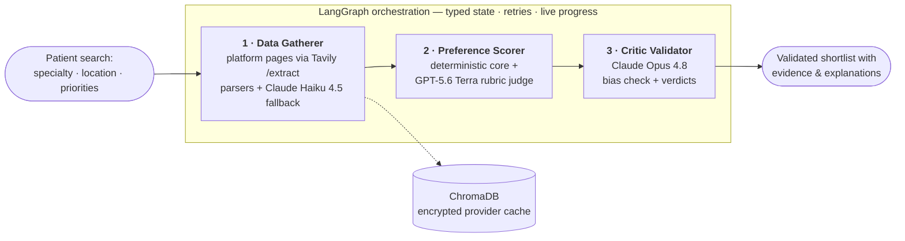
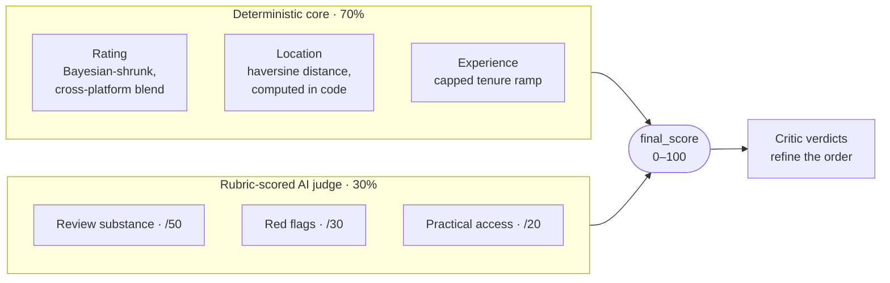
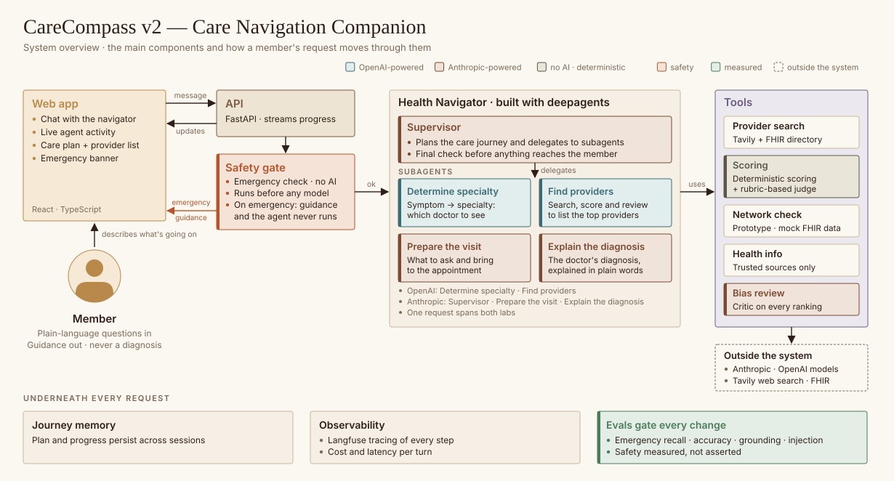

<div align="center">


# CareCompass

**AI-powered healthcare provider matching.** Three specialized LLM agents search the live web,
score every provider against your priorities with cited evidence, and independently validate
the ranking before you ever see it.

[**🎥 3-minute demo**](https://www.loom.com/share/d2d88b31b081442695655dac2b84627f) · [**🔗 Live Demo**](https://sudhakar1109-carecompass.hf.space/) · [**📐 Architecture deep-dive**](docs/ARCHITECTURE.md) · [**🧪 Testing**](#-testing)

[](https://github.com/sudhakargajapathy/CareCompass/actions/workflows/ci.yml)


<br/>

<a href="https://www.loom.com/share/d2d88b31b081442695655dac2b84627f">
  
</a>

</div>

> **Portfolio project.** A working demonstration of multi-agent LLM orchestration applied to
> healthcare provider discovery. An enhanced version built on **deep agents** is in active
> development.
>
> _This is a demo/educational project and is not intended for clinical decision-making._

## 🧭 Why this project is interesting

- **Cross-family multi-LLM design** — the judge (GPT-5.6 Terra) and the critic (Claude Opus 4.8)
  deliberately come from **different model labs**, so the validator is independent of what it audits
- **Deterministic core + AI judgment** — a reproducible 0–100 scoring core (Bayesian-shrunk ratings,
  distances computed in code — the LLM never estimates a number) blended 70/30 with a rubric-scored judge
- **A critic with real power** — it detects bias in the ordering, red-flags providers with cited
  evidence, audits the judge's own rubric citations, and its verdicts re-rank the final list
- **Honest by construction** — every provider that didn't make the shortlist is listed with the
  reason; missing data is labeled, never punished as if it were bad data; even a failed run
  explains whose fault it was
- **Input allowlisting end to end** — every search field is selection-only (State → City → ZIP
  pickers from the same GeoNames dataset that computes distances); free text never reaches a
  query or a prompt
- **Observability built in** — every search is one Langfuse trace carrying the run's health
  record as scores; a golden set of real platform-page templates pins the parsers; metamorphic
  invariants gate every pull request through keyless CI; scheduled canaries and a weekly drift
  report watch the live pipeline
- **Production hygiene** — an identity-keyed provider cache encrypted at rest, a per-search cost
  card (a full search measures **≈ $0.50–0.60**), structured audit logging, and a 1,500+-test
  suite that runs fully mocked

## 🏗️ How it works



The **Data Gatherer** fetches the **three independent patient-review platforms'** own pages
directly via Tavily `/extract` and reads them with deterministic per-platform parsers — LLM
extraction (Claude Haiku 4.5) is the per-page fallback, and source provenance is recorded on
every claim. The **Preference Scorer** ranks with the blend
below. The **Critic Validator** then challenges the whole ordering for bias, writes an
evidence-cited verdict per provider, audits the judge's citations, and its findings refine the
final ranking — deterministic post-processing, no added model calls.

### The scoring blend



The judge scores against **anchored rubric bands with cited evidence** — no gaps a model can
improvise in, and absence of evidence is never penalized. User weights (location / rating /
experience) shape the core; only the weights and the critic's evidence-bound verdicts move scores.

### The three agents at a glance

| # | Agent | Model | What it does |
|---|-------|-------|--------------|
| 1 | **Data Gatherer** | Claude Haiku 4.5 | Fetches the platforms' own listing/profile pages via Tavily `/extract`; deterministic parsers with LLM fallback; cross-platform review enrichment; provenance on every claim |
| 2 | **Preference Scorer** | GPT-5.6 Terra | Weighted deterministic core + rubric judge (`final_score = 0.7 × core + 0.3 × judge`) |
| 3 | **Critic Validator** | Claude Opus 4.8 | Whole-ordering bias analysis, per-provider verdicts with cited evidence, an audit of the judge itself |

Everything the pipeline decides is visible in the UI: live agent progress, a per-search cost
card, an execution timeline, a Responsible-AI panel, and an **"Other providers considered"**
list naming every withheld provider and why. See [docs/ARCHITECTURE.md](docs/ARCHITECTURE.md)
for the full walkthrough.

## 🔁 Field-tested: design decisions from 30+ hardening rounds

This system was iterated against **live searches**: find a real failure, root-cause it,
redesign, and guard the fix with a test that fails without it. Ten decisions that came out
of that loop:

1. **Re-architected fetching when the vendor shifted.** When the search vendor overhauled
   its index and relevance/domain filtering degraded, discovery moved from search queries to
   constructing the review platforms' own URLs and fetching the pages directly — with the old
   pipeline kept intact behind one env flip as a rollback lever. The candidate pool grew
   50 → 120 providers, at lower cost.
2. **Identity is enforced in code, never assumed.** A same-practice colleague once ranked in
   a doctor's name search and nearly shared their ratings. URL-slug vetoes, page-stated-name
   checks, and a state-level address gate now make it structurally hard to put a stranger's
   stars on a card.
3. **Unknown is unknown, not bad.** Missing data scores as explicit equivalences — no rating
   scores the Bayesian prior itself; no tenure scores as a verified 10 years — and an
   imputation can never out-rank a real measurement.
4. **Equal weights are not equal influence.** Measuring realized score spans showed tenure
   (one unshrunk scraped integer) carrying ~3× the leverage of ratings (twice-compressed
   stars); the experience ramp was flattened to restore the intended balance.
5. **An un-anchored rubric is not reproducible.** The AI judge scored identical evidence
   differently across runs wherever its rubric left a gap — so the bands now tile the whole
   range, absence of evidence has its own rung, and every cited quote must be on-topic for
   the criterion it funds.
6. **Silent truncation is a ranking bug.** Flat token ceilings cut model JSON mid-array with
   no error — at one point deciding *who got recommended*. Output budgets now scale with
   input size, truncation is detected, and complete entries are salvaged.
7. **Same search, same answer.** Run-to-run instability traced to an unseeded anti-anchoring
   shuffle; it is now seeded from the pool itself, and the cache ships under a "warm must
   reproduce cold exactly" acceptance bar.
8. **Free text never reaches a prompt.** Every search field became selection-only, drawn
   from the same geographic dataset that computes distances — closing the last
   prompt-injection surface at the UI.
9. **Failure is a first-class screen.** A live outage once rendered a blank results page; a
   zero-result run now says whose fault it was — system-side (retry) versus coverage (widen
   the search) — and still renders the cost card.
10. **Root-cause beats patching.** A text "flicker" survived three animation fixes because it
    was never animation: opening a panel summoned the scrollbar and rewrapped every line of
    text. One CSS property — `scrollbar-gutter: stable` — ended it.

## 🚀 Quick start (local)

> **Note:** the bundled ZIP-centroid dataset (`data/us_zip_coords.csv.gz`) is stored in
> **Git LFS** — install [git-lfs](https://git-lfs.com) before cloning, or run
> `git lfs pull` afterwards. Without it, distance scoring falls back to coarse
> city/state tiers, the State → City location pickers lose their city list
> (it reads the same dataset), and ~50 location-dependent tests fail.

```bash
# 1. Clone the repository (with LFS)
git lfs install
git clone https://github.com/sudhakargajapathy/CareCompass.git
cd CareCompass

# 2. Create a virtual environment and install dependencies
python -m venv venv && source venv/bin/activate
pip install -r requirements.txt

# 3. Configure API keys
cp .env.example .env          # then edit .env and add your keys

# 4. Run the app
streamlit run app.py
```

The app starts at **http://localhost:8501**. Try the demo case: pick **AZ → Phoenix** in the
State and City dropdowns (ZIP optional — its dropdown lists only Phoenix ZIPs), select
**Neurology**, keep the default 25-mile radius, and click **Find Providers** — then watch the
live agent progress and the per-search cost card.

### Required API keys

| Variable | Used for |
|----------|----------|
| `OPENAI_API_KEY` | GPT-5.6 Terra rubric judge + `text-embedding-3-small` embeddings |
| `APP_ANTHROPIC_API_KEY` | Claude Haiku 4.5 (extraction) + Claude Opus 4.8 (critic) |
| `TAVILY_API_KEY` | Healthcare provider web search |

See [`.env.example`](.env.example) for the full list of optional settings — per-role model
knobs (`GATHERER_MODEL` / `JUDGE_MODEL` / `CRITIC_MODEL`), the research budget
(`MAX_PROVIDERS_TO_ENRICH`), enrichment concurrency, cache TTL, multi-query discovery, search
depth, auth, encryption, rate limiting, TLS, and an optional demo-video embed
(`DEMO_VIDEO_URL` — a Loom link that adds a "Watch the demo" section above "How it works").

## ☁️ Deploy to Hugging Face Spaces

This repo is Docker-ready for Hugging Face Spaces (note the frontmatter at the top of this
file). Create a **Docker** Space, push this repo, and set the API keys above under
**Settings → Secrets**. Also set a stable `ENCRYPTION_KEY` secret (generate one with
`python -c "from cryptography.fernet import Fernet; print(Fernet.generate_key().decode())"`):
provider-cache payloads are encrypted at rest, and without it each restart mints a fresh
ephemeral key, so rows cached by earlier runs can never be read again and the cache stays
permanently cold. Binary assets ship through Git LFS, which Spaces requires for files like
`data/us_zip_coords.csv.gz`.

## 🧪 Testing

A 1,500+-test pytest suite with fully mocked clients — no live API keys, no network:

```bash
python -m pytest -q --no-cov
```

The suite grew through 30+ documented field-test-and-fix rounds against live searches; every
fix ships with a test that fails without it. It includes a **golden set** of real
platform-page templates (`evals/`) that pins every parser offline, and **metamorphic
invariants** over the scoring core — monotonicity, imputation equivalences, order and scale
invariance — that gate every pull request through keyless CI.

## 🔧 Under the hood

| Package | Purpose | Version |
|---------|---------|---------|
| **streamlit** | Web application framework | 1.59.1 |
| **langchain** / **langgraph** | LLM framework + workflow orchestration | 0.1.0 / 0.0.20 |
| **anthropic** | Claude API client (extraction + critic) | 0.75.0 |
| **openai** | GPT-5.6 Terra judge + embeddings | 2.14.0 |
| **chromadb** | Vector store / encrypted provider cache | 0.4.18 |
| **tavily-python** | Live-web page fetching + search | 0.7.26 |
| **langfuse** | Optional tracing / observability | 4.15.2 |
| **cryptography** | Fernet encryption at rest | 42.0.0 |

**Model selection rationale:** Haiku 4.5 for fast, cost-effective extraction over many page
excerpts; GPT-5.6 Terra for rubric-scored judging with anchored bands; Opus 4.8 for deep
critical reasoning — deliberately a different model family than the judge it audits.

## 🛣️ Status

**Shipped:** the full multi-agent pipeline above, the Hearth-themed transparency UI,
cross-platform review blending, GeoNames-based geographic scoring, an insurance-directory
verification prototype (FHIR network check — coverage is **simulated** in the demo and labeled
as such on every chip; a real Plan-Net endpoint plugs in via `FHIR_USE_MOCK=false` and runs
the same check live), and an observability layer — per-search Langfuse traces, a golden
parser set, metamorphic CI, and scheduled canaries with a weekly drift report.

**In development:** a ground-up **deep-agents** re-architecture — a conversational care
navigation companion (FastAPI + React). The high-level architecture for v2: a supervisor
plans each member's care journey and delegates to four specialized subagents deliberately
split across two model families; every request clears a deterministic, no-AI safety gate
before any model runs; and evals gate every change — safety measured, not asserted.



## 📄 License & data attribution

MIT — see [LICENSE](LICENSE). ZIP-centroid data in `data/us_zip_coords.csv.gz` derives from
**[GeoNames](https://www.geonames.org)** (CC BY 4.0) and powers the distance ranking. Built
with Anthropic Claude, OpenAI GPT, Tavily search, LangChain/LangGraph, and Streamlit.

## 📞 Contact

**Sudhakar Gajapathy** — 🐙 GitHub: [@sudhakargajapathy](https://github.com/sudhakargajapathy) · 🤗 Hugging Face: [@sudhakar1109](https://huggingface.co/sudhakar1109)

---

<div align="center"><i>Built with ❤️ for better healthcare discovery</i></div>
