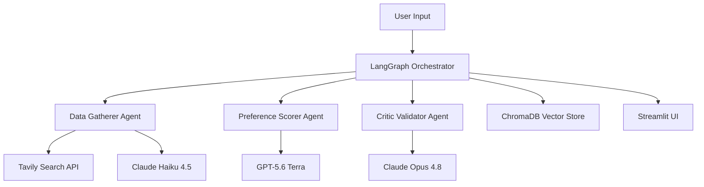

# 🏥 CareCompass: AI-Powered Healthcare Provider Matching

An intelligent multi-agent system that revolutionizes healthcare provider discovery through sophisticated AI-driven matching, ranking, and validation.

> **Portfolio project.** CareCompass is a working demonstration of multi-agent LLM
> orchestration applied to healthcare provider discovery. An enhanced version built on
> **deep agents** is in active development.
>
> _This is a demo/educational project and is not intended for clinical decision-making._

**🔗 Live Demo:** [sudhakar1109-carecompass.hf.space](https://sudhakar1109-carecompass.hf.space/) · **📐 Architecture:** [docs/ARCHITECTURE.md](docs/ARCHITECTURE.md)

## 🧭 What This Demonstrates

- **Multi-agent orchestration** with LangGraph — three specialized agents coordinated through a typed state machine (`WorkflowState`)
- **Cross-family multi-LLM design** — Claude Haiku 4.5 (extraction), GPT-5.6 Terra (rubric-scored judge), and Claude Opus 4.8 (critic); the judge and critic deliberately come from different model families so the validator is independent of what it audits
- **Deterministic core + AI judgment** — a weighted, reproducible 0–100 scoring core (Bayesian-shrunk ratings, code-computed distances) blended 70/30 with a rubric-scored AI judge; the LLM never estimates a distance
- **Self-critique pattern** — a validator agent that detects bias, red-flags providers with cited evidence, and audits the judge's own rubric citations
- **Responsible-AI surfaces** — a bias check panel, withheld-provider transparency (every provider that didn't make the shortlist is listed with the reason), and a per-search cost card
- **RAG / semantic caching** — a ChromaDB enrichment cache keyed by provider identity, encrypted at rest, with a warm-run-must-reproduce-cold-run acceptance bar
- **Production concerns** — typed state, error handling and retries, structured audit logging, and an 809-test suite under [`tests/`](tests/) that runs fully mocked (no API keys, no network)

## 🌟 Overview

CareCompass leverages a sophisticated multi-agent AI architecture to intelligently match patients with healthcare providers. Unlike traditional directory searches, our system employs three specialized AI agents working in concert to deliver transparent, validated, and personalized recommendations.

### Why CareCompass?

- **🤖 Multi-Agent Intelligence**: Three specialized AI agents work together for comprehensive analysis
- **🔍 Transparent Reasoning**: Every recommendation comes with detailed AI explanations
- **🛡️ Critical Validation**: Advanced bias detection and evidence-cited red-flag review
- **📊 Data-Driven Matching**: Sophisticated scoring algorithms with customizable preferences
- **🎯 Semantic Search**: ChromaDB vector store for intelligent provider caching and matching

## 🏗️ System Architecture



See [docs/ARCHITECTURE.md](docs/ARCHITECTURE.md) for the full walkthrough — discovery and enrichment, the scoring core, the judge rubric, the critic's feedback loop, and the caching layer.

### Agent Responsibilities

#### 🔍 **Data Gatherer Agent**
- **AI Model**: Claude Haiku 4.5
- **Purpose**: Discovers providers on the live web and extracts structured data
- **How**: Multi-query Tavily discovery (with adaptive expansion to nearby cities when the home pool is thin), then a per-provider enrichment pass over five independent patient-review platforms
- **Output**: Structured provider profiles with cross-platform ratings, tenure, location, and source provenance for every claim

#### 📊 **Preference Scorer Agent**
- **AI Model**: GPT-5.6 Terra (judge)
- **Purpose**: Ranks providers with a deterministic weighted core plus a rubric-scored AI judge
- **How**: The core scores rating (Bayesian-shrunk, cross-platform blend), location (haversine distance computed in code), and experience under user-set weights; the judge scores review substance, red flags, and practical access against anchored rubric bands with cited evidence
- **Output**: `final_score = 0.7 × core + 0.3 × judge` on a true 0–100 scale, with a full per-dimension breakdown

#### 🛡️ **Critic Validator Agent**
- **AI Model**: Claude Opus 4.8
- **Purpose**: Independently validates rankings and identifies potential issues
- **Analysis**: Bias detection over the whole ordering, plus per-provider deep validation with evidence-cited verdicts (two parallel Claude calls); it also audits the judge's rubric citations against the same evidence
- **Feedback loop**: Findings (red flags, statuses, confidence) are applied to refine the final ranking — pure post-processing, no added latency; only the user's weights and the critic's evidence-bound verdicts move scores

#### 🎯 **LangGraph Orchestrator**
- **Framework**: LangGraph workflow orchestration
- **Purpose**: Coordinates all agents with error handling and retry logic
- **Features**: Typed state management, live progress callbacks, per-search cost tracking, conditional workflow paths
- **Output**: Comprehensive results with execution metadata and step timings

## 🚀 Quick Start (Local)

> **Note:** the bundled ZIP-centroid dataset (`data/us_zip_coords.csv.gz`) is stored in
> **Git LFS** — install [git-lfs](https://git-lfs.com) before cloning, or run
> `git lfs pull` afterwards. Without it, distance scoring falls back to coarse
> city/state tiers and 19 geo tests fail.

```bash
# 1. Clone the repository (with LFS)
git lfs install
git clone https://github.com/sudhakargajapathy/CareCompass.git
cd CareCompass

# 2. Create a virtual environment and install dependencies
python -m venv venv && source venv/bin/activate
pip install -r requirements.txt

# 3. Configure API keys
cp .env.example .env          # then edit .env and add your keys

# 4. Run the app
streamlit run app.py
```

The app starts at **http://localhost:8501**. Try the demo case: **Neurology** specialists in **Phoenix, AZ**.

### Required API Keys

| Variable | Used for |
|----------|----------|
| `OPENAI_API_KEY` | GPT-5.6 Terra rubric judge + `text-embedding-3-small` embeddings |
| `APP_ANTHROPIC_API_KEY` | Claude Haiku 4.5 (extraction) + Claude Opus 4.8 (critic) |
| `TAVILY_API_KEY` | Healthcare provider web search |

See [`.env.example`](.env.example) for the full list of optional settings — per-role model knobs (`GATHERER_MODEL` / `JUDGE_MODEL` / `CRITIC_MODEL`), the research budget (`MAX_PROVIDERS_TO_ENRICH`), enrichment concurrency, cache TTL, multi-query discovery, search depth, auth, encryption, rate limiting, and TLS.

## ☁️ Deploy to Hugging Face Spaces

This repo is Docker-ready for Hugging Face Spaces (note the frontmatter at the top of this file). Create a **Docker** Space, push this repo, and set the API keys above under **Settings → Secrets**. Binary assets ship through Git LFS, which Spaces requires for files like `data/us_zip_coords.csv.gz`.

## 🎯 Features

### Core Capabilities

- **🔍 Intelligent Search**: Multi-query live-web discovery with adaptive nearby-city expansion
- **📊 Weighted Ranking**: Customizable preference weights (location, rating, experience) over a deterministic scoring core
- **🤖 AI Explanations**: Judge-attributed strengths and considerations for every ranking decision, with cited evidence
- **🛡️ Bias Detection**: An independent critic reviews the ordering and each provider, and its findings refine the final ranking
- **🧭 Transparent Shortlist**: Scored-but-not-picked providers surface in an "Other providers considered" list with per-row reasons

### Advanced Features

- **Enrichment Cache**: ChromaDB store keyed by provider identity — repeat searches reuse verified review evidence within a TTL instead of re-searching
- **Provenance Tracking**: Review and insurance claims carry their source URLs, classified as profile vs. directory-listing pages
- **Code-Computed Distances**: Vendored GeoNames ZIP/city centroids + haversine — the LLM never estimates a distance
- **Cost Transparency**: A per-search cost card itemizes tokens, search credits, and step timings
- **Workflow Orchestration**: LangGraph-powered agent coordination with live progress
- **Error Handling**: Robust retry logic and graceful degradation — failures are labeled, never hidden
- **Execution Logging**: Structured audit log and a step-by-step agent timeline

### User Interface

- **Hearth Design System**: A warm, professional healthcare theme
- **Minimal Search Form**: Specialty, location, and Low/Medium/High preference controls
- **Provider Cards**: Match ring, "why this match" callout, at-a-glance chips, and expandable AI analysis
- **Agent Workflow View**: Real-time visibility into agent decision processes
- **Responsible-AI Panel**: Bias check, red-flag tiles, and what the ranking *doesn't* capture

## 📋 Usage Examples

### Basic Provider Search

```python
from agents.orchestrator import create_orchestrator

# Initialize orchestrator
orchestrator = create_orchestrator()

# Execute workflow
results = orchestrator.execute_workflow(
    specialty="Neurology",
    location="Phoenix, AZ",
    preferences={
        "location_weight": 0.4,
        "rating_weight": 0.3,
        "experience_weight": 0.3
    }
)

# Access results
recommendations = results["final_recommendations"]
for rec in recommendations:
    provider = rec["provider"]
    print(f"#{rec['rank']}: {provider['name']} - Score: {provider['final_score']}")
```

## 🧪 Testing

### Automated Tests

An 809-test pytest suite with fully mocked clients — no live API keys, no network:

```bash
python -m pytest -q --no-cov
```

### Running the MVP

1. Configure your API keys (see [Quick Start](#-quick-start-local) above)
2. Start the app with `streamlit run app.py` and open http://localhost:8501
3. Configure your search:
   - **Specialty**: Select "Neurology"
   - **Location**: Enter "Phoenix, AZ"
   - **Preferences**: Set Low/Medium/High priority for location, ratings, and experience (all default to Medium)
4. Click "Find Providers" and watch live agent progress; results include an estimated per-search cost card (tokens, API credits, timings)

### Expected Workflow

1. **Data Gathering**: Agent searches for neurologists in Phoenix and enriches each candidate across review platforms
2. **Preference Scoring**: Providers ranked by the weighted core, then rubric-scored by the AI judge
3. **Critical Validation**: Rankings analyzed for bias and red flags; verdicts refine the final order
4. **Results Display**: Top recommendations with detailed AI reasoning — and every withheld provider listed with its reason

## 🔧 Technical Implementation

### Key Dependencies

| Package | Purpose | Version |
|---------|---------|---------|
| **streamlit** | Web application framework | 1.59.1 |
| **langchain** | LLM framework and utilities | 0.1.0 |
| **langgraph** | Workflow orchestration | 0.0.20 |
| **anthropic** | Claude API client | 0.75.0 |
| **openai** | GPT-5.6 Terra + embeddings | 2.14.0 |
| **chromadb** | Vector database | 0.4.18 |
| **tavily-python** | Web search API | 0.3.3 |
| **cryptography** | Fernet encryption at rest | 42.0.0 |

### AI Model Selection Rationale

- **Claude Haiku 4.5**: Fast, cost-effective extraction over many page excerpts
- **GPT-5.6 Terra**: Rubric-scored judging with anchored bands and cited evidence
- **Claude Opus 4.8**: Deep critical reasoning for independent validation — deliberately a different model family than the judge it audits
- **text-embedding-3-small**: High-quality semantic embeddings for the provider store

## 🎯 Portfolio Highlights

### For Healthcare AI Companies

- **Regulatory Awareness**: Bias detection and validation suitable for healthcare compliance
- **Transparent AI**: Every decision explained for patient trust and safety
- **Scalable Architecture**: Multi-agent design ready for enterprise deployment
- **Real-world Application**: Addresses genuine healthcare discovery challenges

### Technical Excellence

- **Production-Quality Code**: Type hints, error handling, logging, documentation
- **Modern AI Stack**: LangGraph, vector databases, cross-family multi-LLM design
- **Clean Architecture**: Separation of concerns with modular agent design
- **User Experience**: Professional healthcare UI with intuitive workflows

### Innovation Highlights

- **Multi-Agent Validation**: A critic that audits both the providers and the judge that scored them
- **Healthcare-Focused**: Specialized for medical provider matching
- **Honest Scoring**: Measured evidence always outranks imputed evidence; missing data is labeled, never penalized as if it were bad data
- **Semantic Caching**: Identity-keyed provider cache with encrypted payloads

## 🛣️ Roadmap

### Phase 1: MVP (Complete)
- ✅ Multi-agent provider matching system
- ✅ Streamlit web interface
- ✅ Validation, bias detection, and ranking refinement

### Phase 2: Advanced Features
- ✅ Patient review sentiment analysis (cross-platform review blend)
- ✅ Geographic scoring (GeoNames centroids + haversine distance)
- ✅ Insurance directory verification prototype (FHIR network check)
- [ ] Real-time appointment availability integration

### Phase 3: Enterprise Features
- [ ] HIPAA compliance framework
- [ ] Provider network optimization
- [ ] Predictive analytics for wait times
- [ ] Integration with EHR systems

### Phase 4: AI Enhancements
- [ ] Deep-agents rearchitecture (in active development)
- [ ] Multimodal analysis (provider photos, office images)
- [ ] Predictive matching based on health conditions
- [ ] Personalization learning from user interactions

## 🤝 Contributing

We welcome contributions to CareCompass! Please see our contributing guidelines for details on:

- Code style and standards
- Testing requirements
- Pull request process
- Issue reporting

### Development Setup

1. Fork the repository
2. Create a feature branch: `git checkout -b feature/amazing-feature`
3. Install development dependencies: `pip install -r requirements.txt`
4. Make your changes with tests
5. Submit a pull request

## 📄 License

This project is licensed under the MIT License - see the [LICENSE](LICENSE) file for details.

## 🙏 Acknowledgments

- **Anthropic** for Claude AI models
- **OpenAI** for GPT models and embeddings
- **Tavily** for healthcare web search capabilities
- **LangChain/LangGraph** for agent orchestration framework
- **Streamlit** for rapid web application development
- **GeoNames** (geonames.org) for the US ZIP centroid data in
  `data/us_zip_coords.csv.gz`, used for distance ranking (CC BY 4.0)

## 📞 Contact

**Project Maintainer**: Sudhakar Gajapathy
- 🐙 GitHub: [@sudhakargajapathy](https://github.com/sudhakargajapathy)
- 🤗 Hugging Face: [@sudhakar1109](https://huggingface.co/sudhakar1109)

---

*Built with ❤️ for better healthcare discovery*
