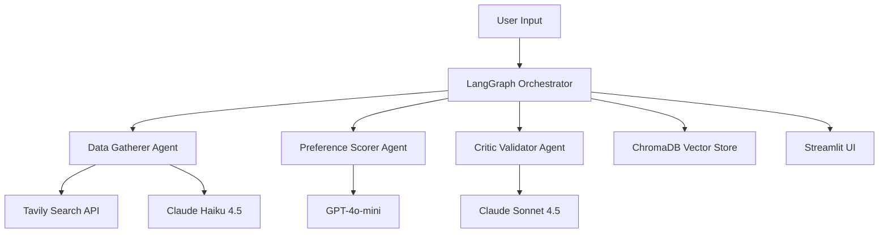

# 🏥 CareCompass: AI-Powered Healthcare Provider Matching

An intelligent multi-agent system that revolutionizes healthcare provider discovery through sophisticated AI-driven matching, ranking, and validation.

> **Portfolio project.** CareCompass is a working demonstration of multi-agent LLM
> orchestration applied to healthcare provider discovery. An enhanced version built on
> **deep agents** is in active development.
>
> _This is a demo/educational project and is not intended for clinical decision-making._

**🔗 Live Demo:** _add your Hugging Face Spaces URL here_ · **📐 Architecture:** [docs/ARCHITECTURE.md](docs/ARCHITECTURE.md)

## 🧭 What This Demonstrates

- **Multi-agent orchestration** with LangGraph — three specialized agents coordinated through a typed state machine (`WorkflowState`)
- **Multi-LLM integration** — Claude Haiku 4.5, Claude Sonnet 4.5, and GPT-4o-mini, each selected for a specific role
- **RAG / semantic search** — ChromaDB vector store with OpenAI embeddings for provider caching and matching
- **Self-critique pattern** — a dedicated validator agent for bias detection and alternative perspectives
- **Production concerns** — typed state, error handling and retries, structured logging, and a real test suite under [`tests/`](tests/)

## 🌟 Overview

CareCompass leverages a sophisticated multi-agent AI architecture to intelligently match patients with healthcare providers. Unlike traditional directory searches, our system employs three specialized AI agents working in concert to deliver transparent, validated, and personalized recommendations.

### Why CareCompass?

- **🤖 Multi-Agent Intelligence**: Three specialized AI agents work together for comprehensive analysis
- **🔍 Transparent Reasoning**: Every recommendation comes with detailed AI explanations
- **🛡️ Critical Validation**: Advanced bias detection and alternative perspective analysis
- **📊 Data-Driven Matching**: Sophisticated scoring algorithms with customizable preferences
- **🎯 Semantic Search**: ChromaDB vector store for intelligent provider matching

## 🏗️ System Architecture



### Agent Responsibilities

#### 🔍 **Data Gatherer Agent**
- **AI Model**: Claude Haiku 4.5
- **Purpose**: Searches and extracts provider data
- **Data Source**: Tavily API with healthcare-focused domains
- **Output**: Structured provider profiles with ratings, location, insurance, and contact info

#### 📊 **Preference Scorer Agent**
- **AI Model**: GPT-4o-mini
- **Purpose**: Ranks providers using weighted algorithm + AI analysis
- **Features**: Customizable preference weights, confidence scoring, detailed reasoning
- **Output**: Ranked provider list with comprehensive explanations

#### 🛡️ **Critic Validator Agent**
- **AI Model**: Claude Sonnet 4.5
- **Purpose**: Validates rankings and identifies potential issues
- **Analysis**: Bias detection, alternative perspectives, red flag identification
- **Output**: Validation report with confidence assessment and improvement suggestions

#### 🎯 **LangGraph Orchestrator**
- **Framework**: LangGraph workflow orchestration
- **Purpose**: Coordinates all agents with error handling and retry logic
- **Features**: State management, logging, conditional workflow paths
- **Output**: Comprehensive results with execution metadata

## 🚀 Quick Start (Local)

```bash
# 1. Clone the repository
git clone https://github.com/sudhakargajapathy/CareCompass.git
cd CareCompass

# 2. Create a virtual environment and install dependencies
python -m venv venv && source venv/bin/activate
pip install -r requirements.txt

# 3. Configure API keys
cp .env.example .env          # then edit .env and add your keys

# 4. Run the app
streamlit run app.py
```

The app starts at **http://localhost:8501**. Try the demo case: **Neurology** specialists in **Phoenix, AZ**.

### Required API Keys

| Variable | Used for |
|----------|----------|
| `OPENAI_API_KEY` | GPT-4o-mini ranking + `text-embedding-3-small` embeddings |
| `APP_ANTHROPIC_API_KEY` | Claude Haiku 4.5 (extraction) + Claude Sonnet 4.5 (validation) |
| `TAVILY_API_KEY` | Healthcare provider web search |

See [`.env.example`](.env.example) for the full list of optional settings (auth, encryption, rate limiting, TLS).

## ☁️ Deploy to Hugging Face Spaces

This repo is Docker-ready for Hugging Face Spaces (note the frontmatter at the top of this file). Create a **Docker** Space, push this repo, and set the API keys above under **Settings → Secrets**.

## 🎯 Features

### Core Capabilities

- **🔍 Intelligent Search**: Multi-source provider discovery with semantic matching
- **📊 Weighted Ranking**: Customizable preference algorithms (location, rating, insurance)
- **🤖 AI Explanations**: Detailed reasoning for every ranking decision
- **🛡️ Bias Detection**: Advanced validation to identify potential ranking issues
- **🔄 Alternative Perspectives**: Multiple ranking scenarios for comprehensive analysis
- **📈 Interactive Visualizations**: Provider scoring charts and comparison tools

### Advanced Features

- **Vector Embeddings**: Semantic search using OpenAI text-embedding-3-small
- **Persistent Storage**: ChromaDB for provider data caching and retrieval
- **Workflow Orchestration**: LangGraph-powered agent coordination
- **Error Handling**: Robust retry logic and graceful degradation
- **Execution Logging**: Detailed workflow transparency and debugging

### User Interface

- **Clean Healthcare Design**: Professional, intuitive Streamlit interface
- **Interactive Forms**: Easy-to-use specialty, location, and preference inputs
- **Provider Cards**: Comprehensive provider information with AI insights
- **Agent Workflow View**: Real-time visibility into agent decision processes
- **Validation Insights**: Critical analysis and alternative recommendations

## 📋 Usage Examples

### Basic Provider Search

```python
from agents.orchestrator import create_orchestrator

# Initialize orchestrator
orchestrator = create_orchestrator()

# Execute workflow
results = orchestrator.execute_workflow(
    specialty="Neurology",
    location="Phoenix, AZ",
    insurance="Blue Cross Blue Shield",
    preferences={
        "location_weight": 0.4,
        "rating_weight": 0.3,
        "insurance_priority": 0.3
    }
)

# Access results
recommendations = results["final_recommendations"]
for rec in recommendations:
    provider = rec["provider"]
    print(f"#{rec['rank']}: {provider['name']} - Score: {provider['final_score']}")
```

## 🧪 Testing

### Automated Tests

```bash
pytest                # run the full suite
pytest tests/unit     # unit tests only
```

### Running the MVP

1. Configure your API keys (see [Quick Start](#-quick-start-local) above)
2. Start the app with `streamlit run app.py` and open http://localhost:8501
3. Configure your search:
   - **Specialty**: Select "Neurology"
   - **Location**: Enter "Phoenix, AZ"
   - **Preferences**: Adjust sliders based on your priorities
4. Click "Find Providers" and observe the multi-agent workflow

### Expected Workflow

1. **Data Gathering**: Agent searches for neurologists in Phoenix
2. **Preference Scoring**: Providers ranked based on your weights
3. **Critical Validation**: Rankings analyzed for bias and alternatives
4. **Results Display**: Top recommendations with detailed AI reasoning

## 🔧 Technical Implementation

### Key Dependencies

| Package | Purpose | Version |
|---------|---------|---------|
| **streamlit** | Web application framework | 1.29.0 |
| **langchain** | LLM framework and utilities | 0.1.0 |
| **langgraph** | Workflow orchestration | 0.0.20 |
| **anthropic** | Claude API client | 0.8.1 |
| **openai** | GPT-4 and embeddings | 1.6.1 |
| **chromadb** | Vector database | 0.4.18 |
| **tavily-python** | Web search API | 0.3.3 |
| **plotly** | Interactive visualizations | 5.17.0 |

### AI Model Selection Rationale

- **Claude Haiku 4.5**: Fast, cost-effective data extraction
- **GPT-4o-mini**: Balanced performance for ranking analysis
- **Claude Sonnet 4.5**: Sophisticated reasoning for validation
- **text-embedding-3-small**: High-quality semantic embeddings

## 🎯 Portfolio Highlights

### For Healthcare AI Companies

- **Regulatory Awareness**: Bias detection and validation suitable for healthcare compliance
- **Transparent AI**: Every decision explained for patient trust and safety
- **Scalable Architecture**: Multi-agent design ready for enterprise deployment
- **Real-world Application**: Addresses genuine healthcare discovery challenges

### Technical Excellence

- **Production-Quality Code**: Type hints, error handling, logging, documentation
- **Modern AI Stack**: LangGraph, vector databases, multi-modal AI models
- **Clean Architecture**: Separation of concerns with modular agent design
- **User Experience**: Professional healthcare UI with intuitive workflows

### Innovation Highlights

- **Multi-Agent Validation**: Novel approach to AI ranking verification
- **Healthcare-Focused**: Specialized for medical provider matching
- **Workflow Orchestration**: Sophisticated LangGraph implementation
- **Semantic Search**: Advanced vector similarity matching

## 🛣️ Roadmap

### Phase 1: MVP Enhancement (Current)
- ✅ Multi-agent provider matching system
- ✅ Streamlit web interface
- ✅ Basic validation and bias detection

### Phase 2: Advanced Features
- [ ] Real-time appointment availability integration
- [ ] Patient review sentiment analysis
- [ ] Geographic optimization algorithms
- [ ] Insurance verification APIs

### Phase 3: Enterprise Features
- [ ] HIPAA compliance framework
- [ ] Provider network optimization
- [ ] Predictive analytics for wait times
- [ ] Integration with EHR systems

### Phase 4: AI Enhancements
- [ ] Custom healthcare LLM fine-tuning
- [ ] Multimodal analysis (provider photos, office images)
- [ ] Predictive matching based on health conditions
- [ ] Personalization learning from user interactions

## 🤝 Contributing

We welcome contributions to CareCompass! Please see our contributing guidelines for details on:

- Code style and standards
- Testing requirements
- Pull request process
- Issue reporting

### Development Setup

1. Fork the repository
2. Create a feature branch: `git checkout -b feature/amazing-feature`
3. Install development dependencies: `pip install -r requirements.txt`
4. Make your changes with tests
5. Submit a pull request

## 📄 License

This project is licensed under the MIT License - see the [LICENSE](LICENSE) file for details.

## 🙏 Acknowledgments

- **Anthropic** for Claude AI models
- **OpenAI** for GPT-4 and embedding models
- **Tavily** for healthcare web search capabilities
- **LangChain/LangGraph** for agent orchestration framework
- **Streamlit** for rapid web application development

## 📞 Contact

**Project Maintainer**: Sudhakar Gajapathy
- 🐙 GitHub: [@sudhakargajapathy](https://github.com/sudhakargajapathy)
- 🤗 Hugging Face: [@sudhakar1109](https://huggingface.co/sudhakar1109)

---

*Built with ❤️ for better healthcare discovery*
