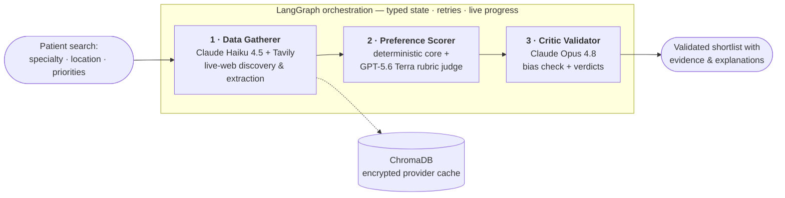

<div align="center">


# CareCompass

**AI-powered healthcare provider matching.** Three specialized LLM agents search the live web,
score every provider against your priorities with cited evidence, and independently validate
the ranking before you ever see it.

[**🎥 3-minute demo**](https://www.loom.com/share/d2d88b31b081442695655dac2b84627f) · [**🔗 Live Demo**](https://sudhakar1109-carecompass.hf.space/) · [**📐 Architecture deep-dive**](docs/ARCHITECTURE.md) · [**🧪 Testing**](#-testing)


<br/>

<a href="https://www.loom.com/share/d2d88b31b081442695655dac2b84627f">
  
</a>

</div>

> **Portfolio project.** A working demonstration of multi-agent LLM orchestration applied to
> healthcare provider discovery. An enhanced version built on **deep agents** is in active
> development.
>
> _This is a demo/educational project and is not intended for clinical decision-making._

## 🧭 Why this project is interesting

- **Cross-family multi-LLM design** — the judge (GPT-5.6 Terra) and the critic (Claude Opus 4.8)
  deliberately come from **different model labs**, so the validator is independent of what it audits
- **Deterministic core + AI judgment** — a reproducible 0–100 scoring core (Bayesian-shrunk ratings,
  distances computed in code — the LLM never estimates a number) blended 70/30 with a rubric-scored judge
- **A critic with real power** — it detects bias in the ordering, red-flags providers with cited
  evidence, audits the judge's own rubric citations, and its verdicts re-rank the final list
- **Honest by construction** — every provider that didn't make the shortlist is listed with the
  reason; missing data is labeled, never punished as if it were bad data; even a failed run
  explains whose fault it was
- **Input allowlisting end to end** — every search field is selection-only (State → City → ZIP
  pickers from the same GeoNames dataset that computes distances); free text never reaches a
  query or a prompt
- **Production hygiene** — an identity-keyed provider cache encrypted at rest, a per-search cost
  card (a full search measures **≈ $0.50–0.60**), structured audit logging, and a 1,100+-test
  suite that runs fully mocked

## 🏗️ How it works



The **Data Gatherer** runs multi-query live-web discovery (with adaptive expansion to nearby
cities when the home pool is thin), then enriches each candidate across **three independent
patient-review platforms** — deterministic page parsers first, LLM extraction as the fallback,
and source provenance recorded on every claim. The **Preference Scorer** ranks with the blend
below. The **Critic Validator** then challenges the whole ordering for bias, writes an
evidence-cited verdict per provider, audits the judge's citations, and its findings refine the
final ranking — deterministic post-processing, no added model calls.

### The scoring blend


The judge scores against **anchored rubric bands with cited evidence** — no gaps a model can
improvise in, and absence of evidence is never penalized. User weights (location / rating /
experience) shape the core; only the weights and the critic's evidence-bound verdicts move scores.

### The three agents at a glance

| # | Agent | Model | What it does |
|---|-------|-------|--------------|
| 1 | **Data Gatherer** | Claude Haiku 4.5 | Live-web discovery, deterministic parsers + LLM-fallback extraction, cross-platform review enrichment, provenance on every claim |
| 2 | **Preference Scorer** | GPT-5.6 Terra | Weighted deterministic core + rubric judge (`final_score = 0.7 × core + 0.3 × judge`) |
| 3 | **Critic Validator** | Claude Opus 4.8 | Whole-ordering bias analysis, per-provider verdicts with cited evidence, an audit of the judge itself |

Everything the pipeline decides is visible in the UI: live agent progress, a per-search cost
card, an execution timeline, a Responsible-AI panel, and an **"Other providers considered"**
list naming every withheld provider and why. See [docs/ARCHITECTURE.md](docs/ARCHITECTURE.md)
for the full walkthrough.

## 🚀 Quick start (local)

> **Note:** the bundled ZIP-centroid dataset (`data/us_zip_coords.csv.gz`) is stored in
> **Git LFS** — install [git-lfs](https://git-lfs.com) before cloning, or run
> `git lfs pull` afterwards. Without it, distance scoring falls back to coarse
> city/state tiers, the State → City location pickers lose their city list
> (it reads the same dataset), and ~50 location-dependent tests fail.

```bash
# 1. Clone the repository (with LFS)
git lfs install
git clone https://github.com/sudhakargajapathy/CareCompass.git
cd CareCompass

# 2. Create a virtual environment and install dependencies
python -m venv venv && source venv/bin/activate
pip install -r requirements.txt

# 3. Configure API keys
cp .env.example .env          # then edit .env and add your keys

# 4. Run the app
streamlit run app.py
```

The app starts at **http://localhost:8501**. Try the demo case: pick **AZ → Phoenix** in the
State and City dropdowns (ZIP optional — its dropdown lists only Phoenix ZIPs), select
**Neurology**, keep the default 25-mile radius, and click **Find Providers** — then watch the
live agent progress and the per-search cost card.

### Required API keys

| Variable | Used for |
|----------|----------|
| `OPENAI_API_KEY` | GPT-5.6 Terra rubric judge + `text-embedding-3-small` embeddings |
| `APP_ANTHROPIC_API_KEY` | Claude Haiku 4.5 (extraction) + Claude Opus 4.8 (critic) |
| `TAVILY_API_KEY` | Healthcare provider web search |

See [`.env.example`](.env.example) for the full list of optional settings — per-role model
knobs (`GATHERER_MODEL` / `JUDGE_MODEL` / `CRITIC_MODEL`), the research budget
(`MAX_PROVIDERS_TO_ENRICH`), enrichment concurrency, cache TTL, multi-query discovery, search
depth, auth, encryption, rate limiting, TLS, and an optional demo-video embed
(`DEMO_VIDEO_URL` — a Loom link that adds a "Watch the demo" section above "How it works").

## ☁️ Deploy to Hugging Face Spaces

This repo is Docker-ready for Hugging Face Spaces (note the frontmatter at the top of this
file). Create a **Docker** Space, push this repo, and set the API keys above under
**Settings → Secrets**. Also set a stable `ENCRYPTION_KEY` secret (generate one with
`python -c "from cryptography.fernet import Fernet; print(Fernet.generate_key().decode())"`):
provider-cache payloads are encrypted at rest, and without it each restart mints a fresh
ephemeral key, so rows cached by earlier runs can never be read again and the cache stays
permanently cold. Binary assets ship through Git LFS, which Spaces requires for files like
`data/us_zip_coords.csv.gz`.

## 🧪 Testing

A 1,100+-test pytest suite with fully mocked clients — no live API keys, no network:

```bash
python -m pytest -q --no-cov
```

The suite grew through 30+ documented field-test-and-fix rounds against live searches; every
fix ships with a test that fails without it.

## 🔧 Under the hood

| Package | Purpose | Version |
|---------|---------|---------|
| **streamlit** | Web application framework | 1.59.1 |
| **langchain** / **langgraph** | LLM framework + workflow orchestration | 0.1.0 / 0.0.20 |
| **anthropic** | Claude API client (extraction + critic) | 0.75.0 |
| **openai** | GPT-5.6 Terra judge + embeddings | 2.14.0 |
| **chromadb** | Vector store / encrypted provider cache | 0.4.18 |
| **tavily-python** | Live-web search API | 0.7.26 |
| **cryptography** | Fernet encryption at rest | 42.0.0 |

**Model selection rationale:** Haiku 4.5 for fast, cost-effective extraction over many page
excerpts; GPT-5.6 Terra for rubric-scored judging with anchored bands; Opus 4.8 for deep
critical reasoning — deliberately a different model family than the judge it audits.

## 🛣️ Status

**Shipped:** the full multi-agent pipeline above, the Hearth-themed transparency UI,
cross-platform review blending, GeoNames-based geographic scoring, an insurance-directory
verification prototype (FHIR network check — coverage is **simulated** in the demo and labeled
as such on every chip; a real Plan-Net endpoint plugs in via `FHIR_USE_MOCK=false` and runs
the same check live).

**In development:** a ground-up **deep-agents** re-architecture (conversational care
navigation, FastAPI + React). Candidate next steps for this codebase: real-time appointment
availability, EHR integration, HIPAA compliance framework.

## 📄 License & data attribution

MIT — see [LICENSE](LICENSE). ZIP-centroid data in `data/us_zip_coords.csv.gz` derives from
**[GeoNames](https://www.geonames.org)** (CC BY 4.0) and powers the distance ranking. Built
with Anthropic Claude, OpenAI GPT, Tavily search, LangChain/LangGraph, and Streamlit.

## 📞 Contact

**Sudhakar Gajapathy** — 🐙 GitHub: [@sudhakargajapathy](https://github.com/sudhakargajapathy) · 🤗 Hugging Face: [@sudhakar1109](https://huggingface.co/sudhakar1109)

---

<div align="center"><i>Built with ❤️ for better healthcare discovery</i></div>
